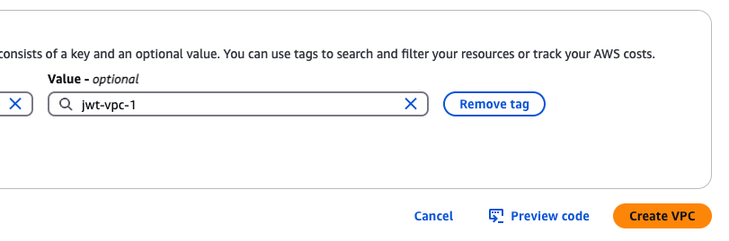
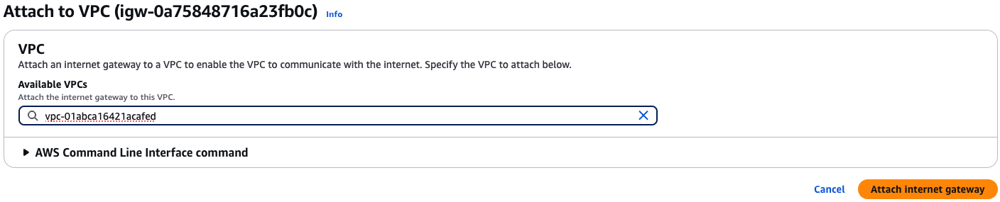
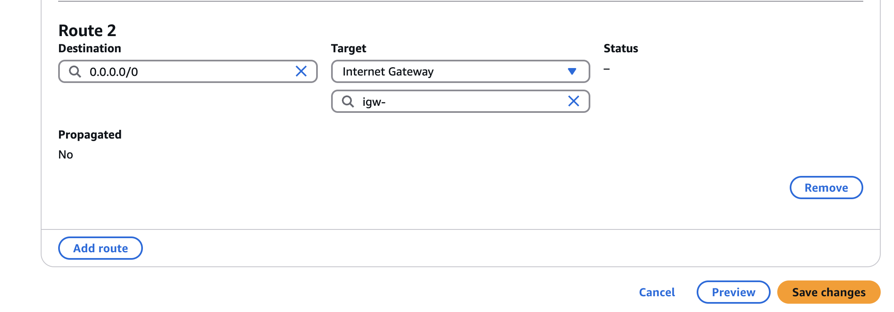

# Chapter 2: Deploying the JWT Authentication System to AWS

Welcome to Chapter 2 of our JWT Authentication System course! In this chapter, we'll deploy our containerized application to Amazon Web Services (AWS). We'll go through the entire process step-by-step, from setting up the necessary AWS resources to running our application on an EC2 instance.

## Table of Contents

- [Introduction](#introduction)
- [Prerequisites](#prerequisites)
- [Setting Up AWS Resources](#setting-up-aws-resources)
  - [Creating a VPC](#creating-a-vpc)
  - [Creating Subnets](#creating-subnets)
  - [Setting Up Internet Gateway](#setting-up-internet-gateway)
  - [Configuring Route Tables](#configuring-route-tables)
  - [Creating Security Groups](#creating-security-groups)
- [Launching an EC2 Instance](#launching-an-ec2-instance)
- [Connecting to the EC2 Instance](#connecting-to-the-ec2-instance)
- [Deploying the Application](#deploying-the-application)
  - [Setting Up the Environment](#setting-up-the-environment)
  - [Running Docker Compose](#running-docker-compose)
- [Testing the Deployed Application](#testing-the-deployed-application)
- [Troubleshooting](#troubleshooting)
- [Conclusion](#conclusion)

## Introduction

In Chapter 1, we built a JWT authentication system using Flask, PostgreSQL, and SQLAlchemy, and containerized it with Docker. Now, we'll deploy this application to AWS so that it can be accessed from anywhere.

We encountered an interesting challenge during our journey: our Docker image was initially built on macOS but needed to run on a Linux-based cloud environment. This led us to learn about multi-platform Docker builds, which we'll cover in this chapter.

## Prerequisites

Before we begin, you'll need:

1. An AWS Account
2. AWS CLI installed and configured with your credentials
3. SSH client (built into macOS/Linux or PuTTY for Windows)
4. Docker Hub account (where our image is already hosted)

## Setting Up AWS Resources

### Creating a VPC

First, we'll create a Virtual Private Cloud (VPC) to isolate our resources:

1. Generate the credentials from the lab. 
2. Browse to AWS Console link & fillup IAM username and password.
3. Change the region to Singapore (ap-southeast-1) the top right corner. Labs are only available for this region.
4. Navigate to the VPC Dashboard 
5. Click "Create VPC" 
6. Enter the following details:

   - Name tag: `jwt-vpc-1`
   - IPv4 CIDR block: `10.0.0.0/16`
   - IPv6 CIDR block: No IPv6 CIDR block
   - Tenancy: Default

   

7. Click "Create VPC" 
8. Finally see the Resource map 

### Creating Subnets

Next, we'll create a public subnet within our VPC:

1.  In the VPC Dashboard, navigate to "Subnets" & Click "Create subnet" 
2.  Enter the following details:

    - VPC ID: Select your `jwt-vpc-1`
    - Subnet name: `jwt-subnet-1`
    - Availability Zone: Choose the first AZ in your region ex. `ap-southeast-1a`
    - IPv4 subnet CIDR block: `10.0.1.0/24`

    

3.  Click "Create subnet" 
4.  Goto "Action" > "Edit Subnet Setting" 
5.  Enable auto assign public ipv4 address. 

### Setting Up Internet Gateway

To allow internet access to our VPC:

1. Navigate to "Internet Gateways" & Click "Create internet gateway" 
2. Enter Name tag: `jwt-igw-1` & Click "Create internet gateway" 
3. Select the newly created gateway and click "Actions" > "Attach to VPC" 
4. Select your `jwt-vpc-1` and click "Attach internet gateway" 

### Configuring Route Tables

Configure the route table for our public subnet:

1. Navigate to "Route Tables"
2. Click "Create route table"
3. Enter the following details:

   - Name tag: `jwt-rt-1`
   - VPC: Select your `jwt-vpc-1`

   

4. Click "Create route table"
5. Select the route table you just created 6. Go to the "Routes" tab and click "Edit routes" 
6. Click "Add route" and enter the following:

- Destination: `0.0.0.0/0` (all IPv4 traffic)
- Target: Select "Internet Gateway" and choose your `jwt-igw-1` 

8. Click "Save changes"
9. Go to the "Subnet associations" tab and click "Edit subnet associations" 
10. Select your `jwt-auth-subnet` and click "Save associations" 

### Creating Security Groups

Create a security group to control inbound and outbound traffic:

1. Navigate to "Security Groups"
2. Click "Create security group" 
3. Enter the following details:

   - Security group name: `jwt-sg-1`
   - Description: `Security group for JWT Authentication app`
   - VPC: Select your `jwt-vpc-1`

   

4. Configure inbound rules:
   - Type: SSH, Source: Your IP
   - Type: Custom TCP, Port range: 5001,  Source: 0.0.0.0/0 (for Flask API)
   - Type: Custom TCP, Port range: 5050, Source: 0.0.0.0/0 (for pgAdmin)
   - Type: Custom TCP, Port range: 5002, Source: 0.0.0.0/0 (for PostgreSQL, if needed) 
5. Configure outbound rules:
   - Type: All traffic, Destination: 0.0.0.0/0 
6. Click "Create security group"

## Launching an EC2 Instance

Now, we'll launch an EC2 instance within our VPC:

1. Navigate to the EC2 Dashboard 
2. Click "Launch instances" 
3. Name the instance : `jwt-ec2-instance-1` 
4. Choose an Amazon Machine Image (AMI):

   - Select "Ubuntu Server 22.04 LTS" (or the latest available)

   

5. Choose an Instance Type:

   - Select "t2.micro" (Free tier eligible)

   

6. Create a new key pair or use an existing one:

   - Key pair name: `jwt-key-pair`
   - Download the key pair (you'll need it to connect). Save it locally where you're working in vscode. Don't share it publically. Add to .gitignore

   

7. Configure instance details: Network Setting > Edit Network Setting

   - Network: Select your `jwt-vpc-1`
   - Subnet: Select your `jwt-subnet-1`
   - Auto-assign Public IP: Enable
   - Firewall (security groups) > Select existing security group > Select Security Group - `jwt-sg-1`

   

8. Add Storage:
   - Keep the default settings (8GB General Purpose SSD)
9. Review and click "Launch"
10. Click "Launch Instances"

## Connecting to the EC2 Instance

Once your instance is running, connect to it using SSH:

1. Make your key pair file accessible only to you:

```bash
chmod 400 jwt-key-pair.pem
```

2. Connect to your instance:

```bash
ssh -i "jwt-key-pair.pem" ubuntu@<your-instance-public-ip>
```

## Deploying the Application

Now that we're connected to our EC2 instance, let's deploy our application.

### Setting Up the Environment

First, update the system and install Docker and Docker Compose:

```bash
# Update system packages
sudo apt update
sudo apt upgrade -y

# Install Docker
sudo apt install docker.io -y

# Add your user to the docker group to run Docker without sudo
sudo usermod -aG docker ubuntu

# Install Docker Compose
sudo apt install docker-compose -y

# Apply group changes without logging out
newgrp docker
```

### Running Docker Compose

Now, let's clone our repository and run the application:

```bash
# Clone the repository
git clone https://github.com/your-username/prosgres-flask-sqlalchemy-auth.git
cd prosgres-flask-sqlalchemy-auth

# Create and configure environment files
cat << EOF > .env
DATABASE_URL=postgresql://user:password@db:5432/auth_db
JWT_SECRET_KEY=your-secret-key
SECRET_KEY=your-flask-secret-key
POSTGRES_USER=user
POSTGRES_PASSWORD=password
POSTGRES_DB=auth_db
EOF

cat << EOF > .env.pgAdmin
PGADMIN_DEFAULT_EMAIL=admin@admin.com
PGADMIN_DEFAULT_PASSWORD=admin
EOF

# Run Docker Compose
docker-compose up -d
```

If you encounter any issues with the Docker image, it might be because we built it on macOS and are trying to run it on Linux. Let's address this:

### Building Multi-Platform Docker Images

To ensure our Docker image works on both macOS and Linux, we'll need to build a multi-platform image:

1. In your local development environment, enable Docker's experimental features:

   - Add `"experimental": true` to your Docker client config
   - For macOS, this is in `~/.docker/config.json`

2. Install and set up Docker BuildKit:

```bash
export DOCKER_BUILDKIT=1
export DOCKER_CLI_EXPERIMENTAL=enabled
```

3. Build and push a multi-platform image:

```bash
docker buildx create --use
docker buildx build --platform linux/amd64,linux/arm64 -t yourusername/flask-jwt-auth:latest --push .
```

4. In your EC2 instance, pull the updated image:

```bash
docker pull yourusername/flask-jwt-auth:latest
docker-compose down
docker-compose up -d
```

## Testing the Deployed Application

Let's verify that our application is running correctly:

1. Check that the containers are running:

```bash
docker ps
```

2. Test network connectivity:

```bash
curl http://localhost:5001/
```

You should see a response like:

```json
{ "message": "Welcome to JWT Auth API", "status": "online" }
```

3. Access your application from your local machine:
   - Flask API: `http://<your-instance-public-ip>:5001`
   - pgAdmin: `http://<your-instance-public-ip>:5050`

Use the Postman collection we created in Chapter 1 to test the API endpoints:

1. Update the base URL to point to your EC2 instance
2. Test the signup, signin, and protected routes

## Troubleshooting

If you encounter any issues, here are some common troubleshooting steps:

1. Check container logs:

```bash
docker-compose logs app
docker-compose logs db
docker-compose logs pgadmin
```

2. Verify that ports are exposed correctly:

```bash
sudo netstat -tulpn | grep LISTEN
```

3. Check the security group to ensure all required ports are open

4. If you have issues connecting to the database, verify the environment variables and connection strings

## Conclusion

Congratulations! You've successfully deployed your JWT authentication system to AWS. Your application is now accessible from anywhere on the internet, running securely on an EC2 instance.

In this chapter, you learned:

1. How to create a VPC with proper networking on AWS
2. How to configure security groups for your application
3. How to launch and connect to an EC2 instance
4. How to deploy your Docker Compose application on an EC2 instance
5. How to build multi-platform Docker images to avoid compatibility issues

However, you may have noticed that setting up all these AWS resources manually is time-consuming and error-prone. In the next chapter, we'll learn how to automate this entire process using Infrastructure as Code with Pulumi, making it repeatable and consistent.

Keep exploring and happy coding!
